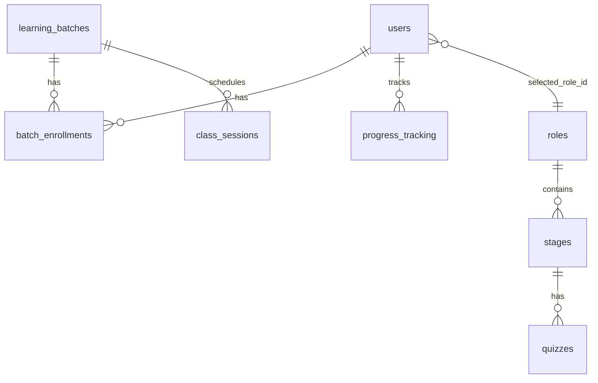

# Calendar schedule — backend & Railway DB design

## Summary

The **Expanded Calendar Drawer** reads a unified event feed. No new database tables are required on Railway: events are aggregated from existing schema at query time.

| UI filter | `event_type` | Source table | Key columns |
|-----------|--------------|--------------|-------------|
| Classes | `class` | `class_sessions` | `session_date`, `start_time`, `end_time`, `batch_id` |
| Quizzes | `quiz` | `quizzes` | `due_date` (+ role via `stages`) |
| Projects | `project` | `stages` | `due_date` (stage milestones for selected role) |

Deadlines without clock times use default blocks (quiz 2–3 PM, project 9–11 AM) so the time grid can render pills.

---

## API

### `GET /api/v1/schedule/calendar`

**Auth:** Bearer JWT (student).

**Query parameters**

| Param | Type | Default | Description |
|-------|------|---------|-------------|
| `start_date` | `YYYY-MM-DD` | Monday of current week | Inclusive range start |
| `end_date` | `YYYY-MM-DD` | `start_date + 6 days` | Inclusive range end (max 93-day span) |
| `include_classes` | bool | `true` | Include `class_sessions` |
| `include_quizzes` | bool | `true` | Include quiz due dates |
| `include_projects` | bool | `true` | Include stage milestone due dates |

**Response**

```json
{
  "start_date": "2026-05-25",
  "end_date": "2026-05-31",
  "events": [
    {
      "id": "class-12",
      "event_type": "class",
      "title": "Django Backend",
      "subtitle": "REST APIs",
      "event_date": "2026-05-26",
      "start_time": "10:00:00",
      "end_time": "12:00:00",
      "batch_name": "Cohort A",
      "status": "scheduled"
    }
  ]
}
```

**Related endpoints (unchanged)**

- `GET /api/v1/schedule/upcoming?limit=5` — dashboard mini list
- `GET /api/v1/schedule/deadlines` — checkbox deadline panel

**Implementation files**

- [`app/api/v1/schedule.py`](../app/api/v1/schedule.py) — route
- [`app/services/calendar_events.py`](../app/services/calendar_events.py) — aggregation
- [`app/schemas/schedule.py`](../app/schemas/schedule.py) — `CalendarEventResponse`

---

## Database (PostgreSQL on Railway)

### Existing tables (no migration for calendar v1)



**Indexes already useful**

- `class_sessions (batch_id, session_date)`
- `class_sessions (status, session_date)`
- `stages.due_date`, `quizzes.due_date`

### Enrollment prerequisite

Students only see **classes** for batches in `batch_enrollments`. Quizzes/projects require `users.selected_role_id` set.

---

## Railway deployment

### Services

1. **Postgres** — `DATABASE_URL` (internal + public URL for local tools)
2. **Backend** — [`railway.toml`](../../railway.toml): `alembic upgrade head` → `uvicorn` via [`scripts/railway_start.sh`](../scripts/railway_start.sh)
3. **Frontend** — [`railway_frontend.toml`](../../railway_frontend.toml): `VITE_API_URL=https://<backend>.up.railway.app`

### Required env (backend)

Copy [`backend/.env.railway.example`](../.env.railway.example):

| Variable | Notes |
|----------|--------|
| `DATABASE_URL` | Postgres plugin reference |
| `SECRET_KEY` | Strong random |
| `ENVIRONMENT` | `production` on Railway |
| `AUTO_CREATE_TABLES` | `false` (use Alembic) |
| `CORS_ORIGINS` | Frontend public URL |

### Bootstrap data

```bash
cd backend
python scripts/railway_seed_all.py
```

Startup also runs `seed_student_dashboard_demo()` for KPI demo emails (`demo@student.com`), which seeds:

- `class_sessions` (upcoming + current-week spread)
- `stages.due_date` / `quizzes.due_date`

### Verify on Railway

```bash
curl https://<backend>/health
curl https://<backend>/health/db

# Login → token
curl -X POST https://<backend>/api/v1/auth/login \
  -H "Content-Type: application/json" \
  -d '{"email":"demo@student.com","password":"<password>"}'

curl "https://<backend>/api/v1/schedule/calendar" \
  -H "Authorization: Bearer <token>"
```

---

## Frontend integration (next step)

```ts
import { fetchCalendarEvents } from '@/lib/api'

const { events } = await fetchCalendarEvents({
  startDate: weekStartIso,
  endDate: weekEndIso,
  includeClasses: filters.classes,
  includeQuizzes: filters.quizzes,
  includeProjects: filters.projects,
})
```

Map `event_date` + `start_time` / `end_time` to `EventBlock` absolute positions in [`ExpandedCalendarDrawer.tsx`](../../src/components/calendar/ExpandedCalendarDrawer.tsx).

---

## Future schema (optional v2)

Only add tables if you need recurrence, external calendars, or student-created blocks:

- `calendar_events` (user_id, type, title, starts_at, ends_at, source)
- `calendar_event_attendance` (event_id, user_id, status)

Until then, keep aggregating from `class_sessions` + due dates to avoid drift between dashboard and drawer.
