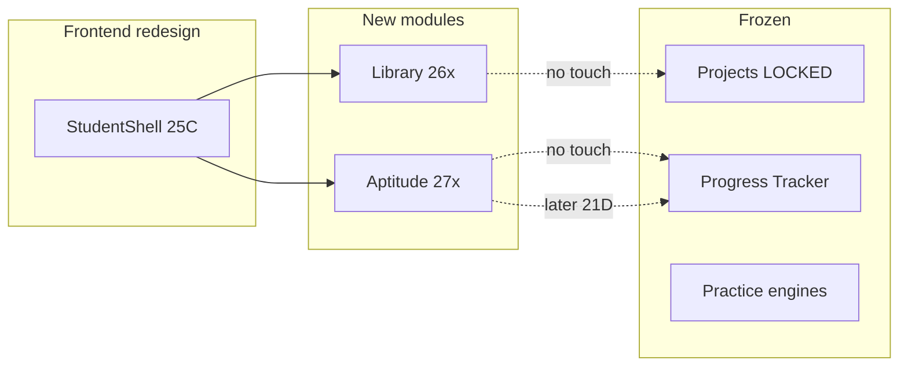

# Code Quest — Module Backlog

**Last updated:** 2026-06-28  
**Status:** Planning only — no Library or Aptitude app code until dedicated phases merge.

---

## Current status

| Module | Status | Student UI | Admin | Backend |
| --- | --- | --- | --- | --- |
| **Projects** | **LOCKED / FROZEN** | Existing list + learning view | Unchanged | Unchanged |
| **Library** | Not started | — | Publish later | — |
| **Aptitude** | Not started | — | Question bank later | — |
| **Jobs** | Production-verified (24A–24G) | Student Jobs page | Job Refresh + Email Station (Jobs Radar) | `/api/jobs`, `/api/admin/jobs/*` |
| **Practice (code/SQL/typing/PBI)** | Historical baseline | Shipped | — | Executors + localStorage |

---

## Locked decisions

1. **Projects module is frozen.** No new project templates, learning flows, or UI redesign. P0 production fixes only with explicit phase.
2. **Library and Aptitude** are greenfield modules — they do not replace Projects or Progress Tracker.
3. **No new dependencies** in module foundation phases without PR approval.
4. **Admin publishing** for Library is a **later sub-phase** — student read-only MVP first.
5. **Aptitude progress** is module-local initially; unified sync deferred to `phase-21d-unified-progress-sync`.
6. **Verification rule:** modules are “complete” only with API JSON + UI route proof + smoke script output.
7. **PR merge safety rule** — [CODE_QUEST_ENGINEERING_RULES.md](./CODE_QUEST_ENGINEERING_RULES.md).

---

## Projects (frozen)

| Aspect | Policy |
| --- | --- |
| **Features** | No new features |
| **UI** | No redesign until [FRONTEND_REDESIGN_RULES.md](./FRONTEND_REDESIGN_RULES.md) unlocks Projects in [PROJECT_ROADMAP.md](./PROJECT_ROADMAP.md) |
| **Content** | No new project catalog entries without product sign-off |
| **Allowed work** | P0 breakage: list won't load, learning view 500, auth guard failure |
| **Smoke** | `ProjectsPage` + `ProjectLearningPage` load; back navigation works |

---

## Library module (planned)

### Vision

Curated learning resources: **articles**, **books**, **interview tips**, **roadmaps**, **cheat sheets** — student browse/read; **admin publishing later**.

### Planned content types

| Type | Student MVP | Admin later |
| --- | --- | --- |
| Articles | Read markdown/HTML render | CRUD + draft/publish |
| Books | External link + metadata | Curate list |
| Interview tips | Tagged short entries | CRUD |
| Roadmaps | Link/embed or static JSON | Curate |
| Cheat sheets | PDF/link or inline sheet | Upload + publish |

### Pending phases

| Phase | Branch (proposed) | Deliverable |
| --- | --- | --- |
| **26A** | `phase-26a-library-module-foundation` | Route `/library`, list + detail, static/JSON content source |
| **26B** | `phase-26b-library-content-seed` | Initial seed content + categories |
| **26C** | `phase-26c-library-admin-publish` | Admin CRUD, draft/publish, role guard |

### Risks

| Risk | Mitigation |
| --- | --- |
| Scope creep into CMS | 26A read-only; no WYSIWYG until 26C |
| AGPL/content licensing | Original or licensed content only; link out for books |
| Nav clutter | Single Library entry in shell; sub-tabs inside module |

### Output-based testing (26A)

- [ ] `/library` renders without blank screen  
- [ ] Category filter returns expected count (fixture JSON)  
- [ ] Detail page loads for one article and one cheat sheet  
- [ ] Empty category shows empty state copy  
- [ ] `npm run build` passes  

---

## Aptitude module (planned)

### Vision

Quantitative and logical aptitude practice: **question bank**, **topic practice**, **timed tests**, **explanations**, **scoring**, **mistake review**, **progress tracking**.

### Planned capabilities

| Capability | MVP (27A) | Later |
| --- | --- | --- |
| Question bank | Static JSON or DB seed | Admin import |
| Topic practice | Untimed, immediate feedback | Adaptive difficulty |
| Timed tests | Fixed duration mock | Leaderboards (optional) |
| Explanations | Per-question rationale | Rich media |
| Scoring | Simple correct/total | Section weights |
| Mistake review | Session mistakes list | Spaced repetition |
| Progress tracking | Module-local storage/API | Sync with 21D unified progress |

### Pending phases

| Phase | Branch (proposed) | Deliverable |
| --- | --- | --- |
| **27A** | `phase-27a-aptitude-module-foundation` | Route `/aptitude`, topic picker, 5-question practice loop |
| **27B** | `phase-27b-aptitude-timed-tests` | Timed test mode + results summary |
| **27C** | `phase-27c-aptitude-mistake-review` | Mistake bank + retry flow |
| **27D** | `phase-27d-aptitude-admin-bank` | Admin question CRUD/import |

### Risks

| Risk | Mitigation |
| --- | --- |
| Duplicate Progress Tracker | Module-local metrics; don't modify Progress Tracker page |
| Question quality | Seed from verified bank; version field per question |
| Cheating on timed tests | Client timer acceptable for MVP; server timing in 27B+ if needed |

### Output-based testing (27A)

- [ ] `/aptitude` loads topic list  
- [ ] Start practice → 5 questions navigable  
- [ ] Submit answer → explanation visible  
- [ ] Score shown at end (`correct/total`)  
- [ ] `npm run qa:practice-smoke` still passes  

---

## Completed phases (module-related, verified)

| Phase | Module | Proof |
| --- | --- | --- |
| **24A** | Jobs | Ingestion + listing — PR #74 |
| **24B** | Jobs/email safety | PR #75 |
| **24C** | Jobs/email transport | PR #76 |
| **24E** | Jobs/email admin station | PR #78 |
| **24F** | Jobs/email premium digest | PR #81 |
| **24G** | Jobs/email Jobs Radar digest | PR #84 |

**Not verified in this tracker:** SQL, Code Workbench, typing, Power BI, Resume, Calendar APIs — treat as baseline only.

---

## Cross-module dependencies



---

## Next branch order

1. **`phase-25a-project-roadmap-live-tracker`** — docs refresh (current)  
2. **`phase-25c-frontend-shell-integration`** (continued) — next master-plan page; nav slot for Library/Aptitude  
3. **`phase-26a-library-module-foundation`**  
4. **`phase-27a-aptitude-module-foundation`**  

---

## Global output-based testing requirements

### Any new module phase

```bash
npm run build
npm run lint
npm run dev:all
npm run qa:practice-smoke   # ensure practice untouched
```

### Backend module APIs (when added)

```bash
cd backend && python -m unittest discover -s tests -v
```

### Documentation

- Update [PROJECT_ROADMAP.md](./PROJECT_ROADMAP.md) status table  
- Add issues to [LIVE_ISSUE_TRACKER.md](./LIVE_ISSUE_TRACKER.md) if blockers found  
- Complete **PR merge safety** checklist before merge  

---

_Related: [PROJECT_ROADMAP.md](./PROJECT_ROADMAP.md) · [LIVE_ISSUE_TRACKER.md](./LIVE_ISSUE_TRACKER.md) · [FRONTEND_REDESIGN_RULES.md](./FRONTEND_REDESIGN_RULES.md) · [CODE_QUEST_ENGINEERING_RULES.md](./CODE_QUEST_ENGINEERING_RULES.md)_
